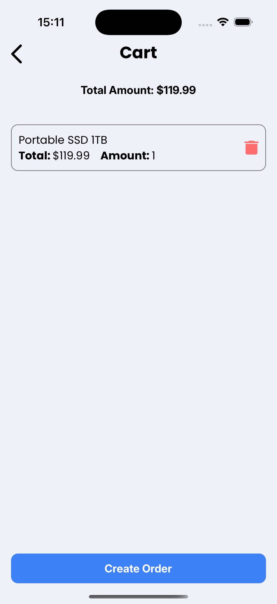

# Awesome Store 

## Overview 
This project is a full-stack application featuring a Nest.js backend with PostgreSQL and Prisma, and a React Native frontend. It supports user authentication, email verification, product management, and an orders system with payment and delivery tracking.

## Features 

### Backend 
- Built with Nest.js, PostgreSQL, and Prisma.

- Implements user authentication with email verification.

- Admin-only CRUD operations for product management.

- Order management system with payment and delivery tracking, linked to users and products.

### Frontend 

- Developed with React Native.

- Uses React Query and Zustand persist for local storage.

- Features:

  - User authentication (sign-up, login, update profile).

  - Product browsing and filtering.

  - Shopping cart and order placement.

  - Bottom Sheet for sorting orders by status, payment, delivery, and date.
 

## Instalation & Setup 

### Backend 

1. Install dependencies:
   ```bash
   $ yarn install
   ````
   
2. Configure environment variables in .env file.
   
4. Run migrations:
   ```bash
   $ yarn prisma migrate dev
   ```
   
5. Start the backend server:
   ```bash
   $ yarn start:dev
   ```

### Frontend 

1.  Install dependencies:
    ```bash
    $ yarn install
    ```

2. Start the React Native app:
   ```bash
   $ yarn start
   ```

## Tech Stack 

- Backend: Nest.js, PostgreSQL, Prisma
- Frontend: React Native, Expo, React Query, Zustand, Bottom Sheet, React Navigation

## Gallery 

#### Auth Screens

  

#### Products Screen

 

#### Orders Screen

 

#### Cart Screen

 

#### Settings Screens

  
